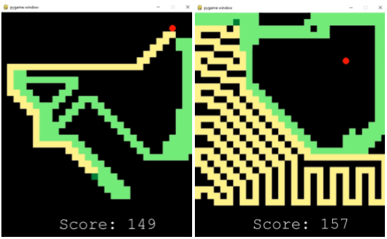

# Snake A-star
Implementation of A-Star algorithm in Snake Game for my Artificial Intelligence class.

## Used
- A-star: To find the shortest path
- Reverse A-star: To find the largest path

## Video
- version 0.99

